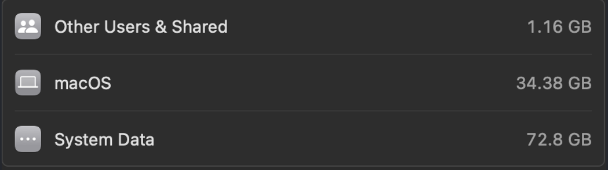
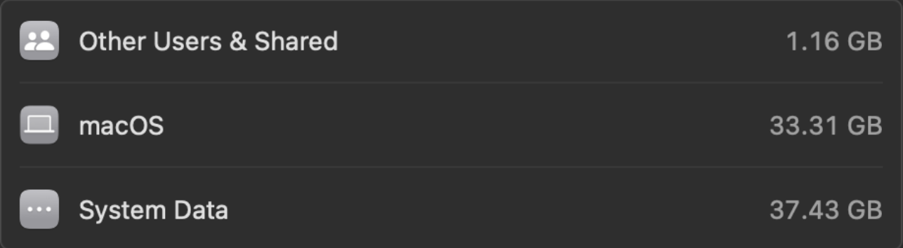

# 💥 Mac Bloat Buster

This guide summarizes the **essential steps** I used to clean my MacBook Air M1 and reduce "System Data" from **~73GB to ~38GB**.

Focus: **lightweight**, **practical**, and **storage-saving**. 🚀

## 🔍 Visualize Disk Usage

To better understand where your disk space is being consumed, you can use:

- **[GrandPerspective](https://grandperspectiv.sourceforge.io/)** (Free, lightweight graphical disk usage visualizer)

✅ GrandPerspective helps you create a visual map of your files and folders, making it easy to spot large and unnecessary files.

---

## 🧹 Key Cleanup Areas

| Component | Cleanup Action |
|:---|:---|
| Homebrew Caches | `brew cleanup --prune=all` |
| User Caches | `rm -rf ~/Library/Caches/*` |
| npm Cache | `npm cache clean --force` |
| Maven Cache | `rm -rf ~/.m2/repository` |
| Gradle Cache | `rm -rf ~/.gradle/caches` |
| Xcode Derived Data | `rm -rf ~/Library/Developer/Xcode/DerivedData` |
| Old iOS Device Backups | Delete via Finder or `~/Library/Application Support/MobileSync/Backup` |
| System Logs | `sudo rm -rf /private/var/log/*` |
| Unused Homebrew Formulae | `brew autoremove` |

✅ These steps safely removed **30+ GB** of hidden files.

---

## 🛠️ System Cleanup Script

**File:** `mac_auto_cleanup.sh`

---

## ⏰ Automate with Cron Job

You can schedule this script to run automatically every week using `cron`:

1. Open your crontab editor:

```bash
crontab -e
```

2. Add the following line to schedule the script every Sunday at 10 AM:

```bash
0 10 * * 0 /path/to/your/mac_auto_cleanup.sh
```

(Replace `/path/to/your/` with the actual path where your `mac_auto_cleanup.sh` script is located.)

✅ Now, the cleanup will run automatically without needing manual execution!

---

# 🚀 Goal

> "Minimal clutter, faster Mac, maximum usable storage."

✅ This helped me reclaim over **30+GB** of lost storage!

<h2 align="center">📸 System Data Before vs After Cleanup</h2>

<p align="center">
  
  &nbsp; &nbsp; &nbsp;
  
</p>


